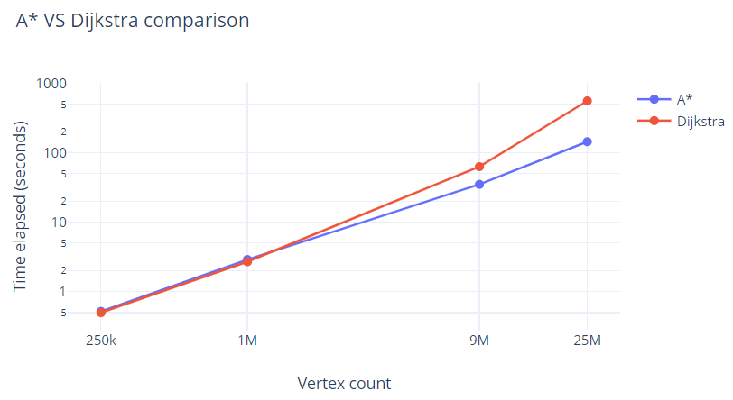
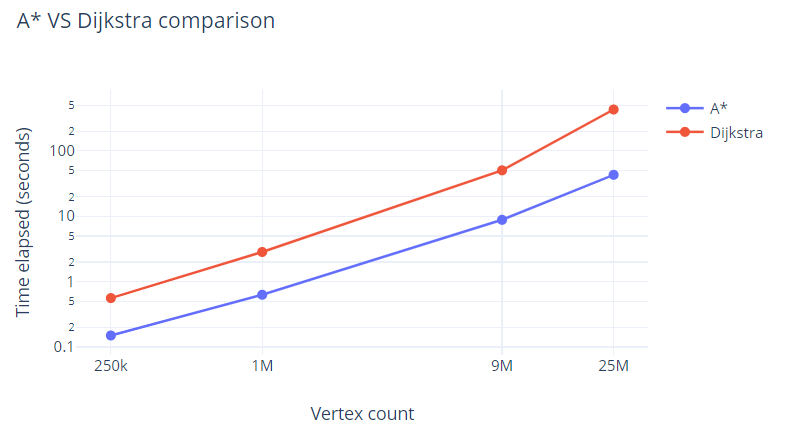

# Shortest Path Problem

[](https://github.com/amytnyk/shortestpathfinder/actions/workflows/pylint.yml)
[](https://github.com/amytnyk/shortestpathfinder/actions/workflows/tests.yml)

## Модуль dijkstra
### Ініціалізація
```
rows = len(heights)
cols = len(heights[0])

heap = []
heapq.heappush(heap, [0., point1])
parents = [[(-1, -1) for _ in range(cols)] for _ in range(rows]
distances = [[inf for _ in range(cols)] for _ in range(rows)]

parents[point1[0]][point1[1]] = (0, 0)
distances[point1[0]][point1[1]] = 0
```
* У distances[row][col] будемо зберігати найкоротшу відстань від початкової координати до (row, col), спочатку всі вершини містять нескінченність як індикатор того, що шлях ще не знайдений
* У parents[row][col] будемо зберігати координату вершини, із якої ми прийшли у (row, col), спочатку всі вершини містять (-1, -1) як індикатор того, що шлях ще не знайдений
* У структурі даних heap зберігатимемо вершини, які ми розглядаємо. Спочатку там міститься початкова вершина.
### Хід алгоритму
```
while heap:
       dist, [py, px] = heapq.heappop(heap)
       if (py, px) == point2:
           break
       if dist > distances[py][px]:
           continue
       for dx, dy in [(0, 1), (0, -1), (-1, 0), (1, 0)]:
           y = py + dy
           x = px + dx
           if 0 <= y < rows and 0 <= x < cols:
               height_diff = heights[py][px] - heights[y][x]
               new_dist = dist + sqrt(step * step + height_diff * height_diff)
               if distances[y][x] > new_dist:
                   parents[y][x] = (py, px)
                   distances[y][x] = new_dist
                   heapq.heappush(heap, [new_dist, (y, x)])
```
* Поки всі вершини не розглянуті, ми беремо з heap координату із найкоротшою відстанню до початкової
* Якщо це кінцева вершина, то закінчуємо ітерацію
* Якщо вже був знайдений шлях коротший, за той, що пропонується, то одразу переходимо на нову ітерацію циклу
* Ітеруємо всі координати вершин, які суміжні з даною, і рахуємо нову довжину шляху для них. Якщо до сусідньої вершини не було знайдено шляху коротшого, то оновлюємо його та масив parents і додаємо в heap вершину на розгляд.
### Backtracking (пошук з поверненням)
```
path = [point2]
while path[-1] != point1:
    path.append(parents[path[-1][0]][path[-1][1]])
return distances[point2[0]][point2[1]], path[::-1]
```
* Нехай у масиві path буде зберігатися шлях із кінцевої вершини в початкову, тоді напочатку path має один елемент: кінцеву вершину
* На кожній ітерації, поки в шлях не буде додана початкова вершина, будемо додавати в path вершину з якої ми прийшли в останній елемент path
* Після завершення ітерації повертаємо кортеж із самої довжини шляху та масив координат шляху
### Оцінка складності алгоритму
* Оскільки ми розглядаємо максимум n вершин і для кожної з них виконуємо операції додати в heap і виняти з heap, складність яких O(log(n)), то загальна складність алгоритму O(nlog(n)). Реальний час роботи буде представлений згодом
### Команда для запуску алгоритму Dijkstra для тесту test.txt і запису результату у файл result.txt
```
python3.9 core/finder.py tests/test.txt results/result.txt --dijkstra
```
## Модуль A*

## Порівняння алгоритмів A* та Dijkstra
### Порівнняння на тестах, де потрібно йти з лівого верхнього кута мапи в правий нижній:

Можемо бачити, що при малій кількості вершин час роботи приблизно однаковий, а от при 5000x5000 (25*10^6) A\* працює приблизно в 5 разів швидше за Dijkstra
### Порівнняння на тестах, де потрібно йти з (size / 3, size / 3) в (size * 2 / 3, size * 2 / 3):

Можемо бачити, майже ту саму ситуацію, тільки на 25M вершин A\* працює вже приблизно в 5 разів швидше за Dijkstra

## Features

To generate test:
```
python3.9 ./generator/generator.py tests/test.txt --rows 500 --cols 500 --end_row 499 --end_col 499
```

To run python version:
```
python3.9 ./python/finder.py tests/test.txt results/result_py.txt
```

The following command would print nothing if results are equal:
```
diff results/result_py.txt results/result_cpp.txt
```


This app was developed by a team of CS students at UCU.